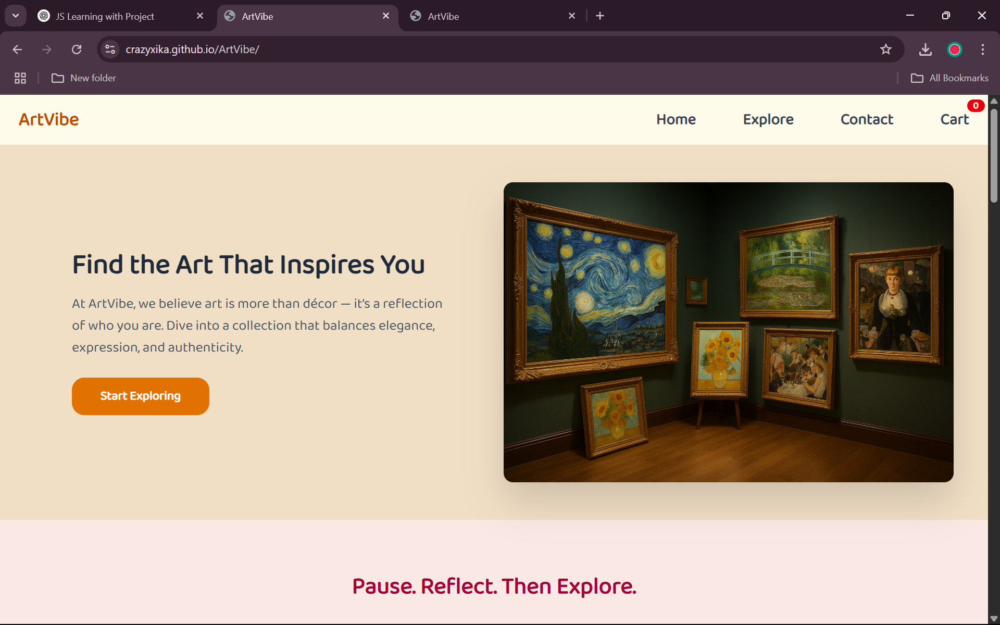
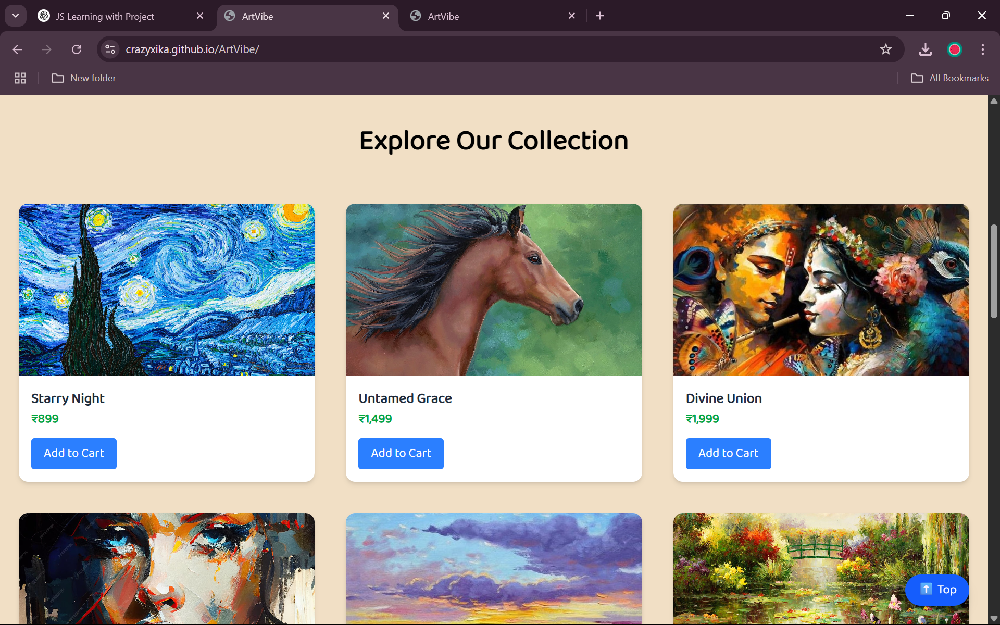

# 🎨 ArtVibe

**ArtVibe** is a fully responsive and interactive art-selling website built using **HTML**, **Tailwind CSS**, and **JavaScript**. It’s designed to give users a delightful browsing experience while exploring a curated collection of beautiful artworks.

---

## 🌟 Features

- ✅ Clean, modern, and mobile-responsive design using Tailwind CSS
- 🛒 **Add to Cart** button with real-time cart count update (JavaScript)
- 🔽 **View All Artworks** button to reveal more art cards dynamically
- ⬆️ **Back to Top** button that appears on scroll
- 🌐 Smooth navigation through anchor links
- 💌 Footer with contact and social media links

---

## 🖼️ Screenshots

### 🔹 Home Section

### 🔹 Gallery & Art Cards

### 🔹 Footer & Reviews

---

## 🔧 Tech Stack

| Tech | Description |
|------|-------------|
| 💻 HTML | Structure of the website |
| 🎨 Tailwind CSS | Styling and layout |
| ⚙️ JavaScript | Interactivity (cart count, view all, back to top) |

---

## 🚀 Live Demo

🔗 [Click Here to View Live](https://crazyxika.github.io/ArtVibe/)  

---

